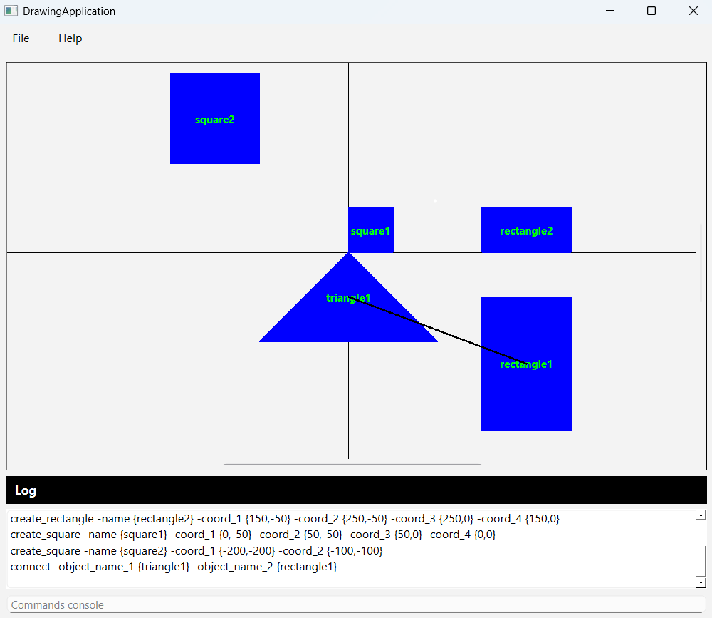
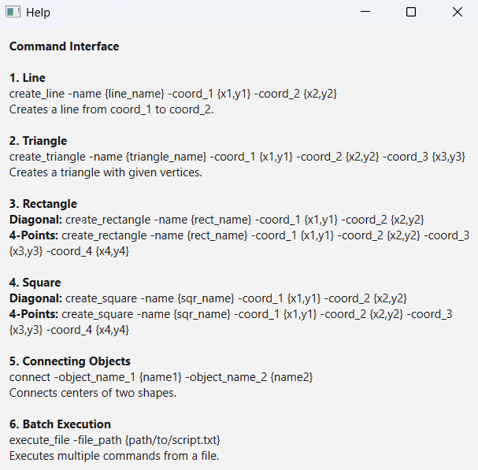

# Drawing Application (Qt C++)

A desktop application built with **Qt (C++17)** that allows users to draw geometric shapes on a canvas using text commands.
Supported shapes include **lines, triangles, rectangles, squares.**.
The project also supports batch command execution, object connections, and live logging.

## 🚀 Features

- You can draw shapes by typing commands into the log/command window:
- Execute file script
- Open file and execute

## 🖥️ Technologies

- **C++17**
- **Qt 6**

## 📦 Installation & Run

1. Clone the repository:
   ```bash
   git clone https://github.com/VaheZilabyan/Drawing-Application.git
2. Open the project in **Qt Creator**.
Build and run the project from Qt Creator.

## Usage
Command Interface
  ```  
  1. Line
  create_line -name {line_name} -coord_1 {x1,y1} -coord_2 {x2,y2}
  Creates a line from coord_1 to coord_2.
  
  2. Triangle
  create_triangle -name {triangle_name} -coord_1 {x1,y1} -coord_2 {x2,y2} -coord_3 {x3,y3}
  Creates a triangle with given vertices.
  
  3. Rectangle
  Rectangle: create_rectangle -name {rect_name} -coord_1 {x1,y1} -coord_2 {x2,y2}
  4-Points: create_rectangle -name {rect_name} -coord_1 {x1,y1} -coord_2 {x2,y2} -coord_3 {x3,y3} -coord_4 {x4,y4}
  
  4. Square
  Diagonal: create_square -name {sqr_name} -coord_1 {x1,y1} -coord_2 {x2,y2}
  4-Points: create_square -name {sqr_name} -coord_1 {x1,y1} -coord_2 {x2,y2} -coord_3 {x3,y3} -coord_4 {x4,y4}
  
  5. Connecting Objects
  connect -object_name_1 {name1} -object_name_2 {name2}
  Connects centers of two shapes.
  
  6. Batch Execution
  execute_file -file_path {path/to/script.txt}
  Executes multiple commands from a file.
  ```

##  📷 Screenshot
### Main Window:

### Help Window:


## 📜 License
This project is for educational purposes. Feel free to modify and improve it.
